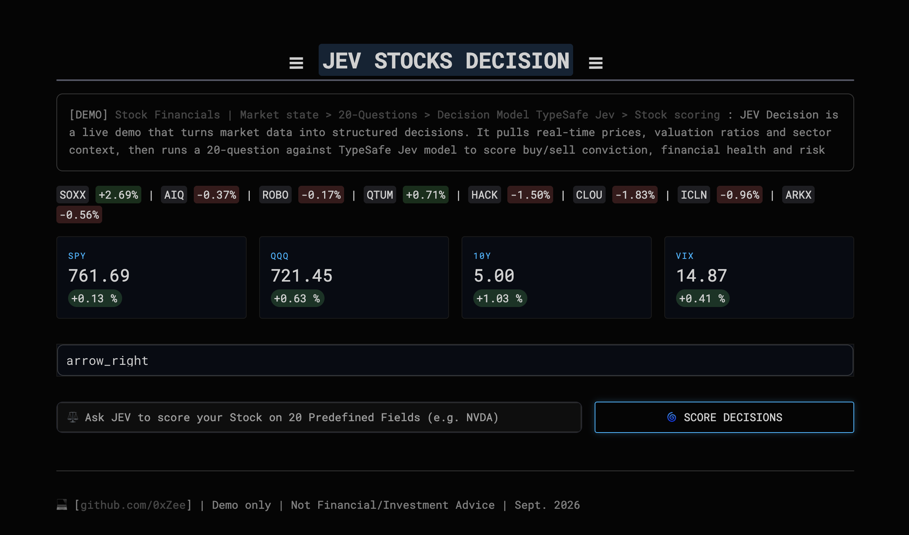
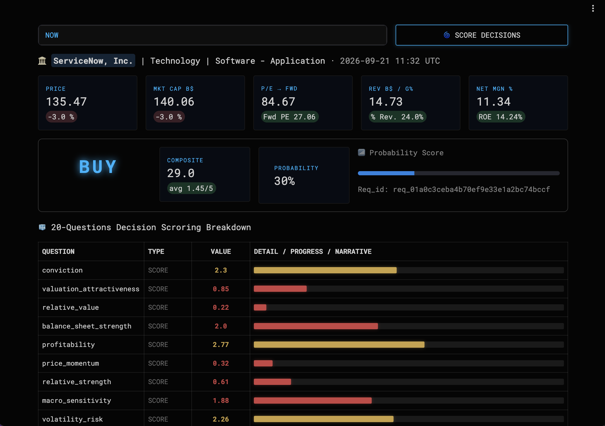

# `JEV` Stock Decision Maker

A demo that turns live market data into structured investment decisions using the **TypeSafe Jev** Decision Model (RLCD).


-


---

## What is TypeSafe Jev?

TypeSafe Jev is a typed decision-model API.  
Instead of free-form LLM answers, you define a set of **questions** with strict output schemas:

- `Choice` → discrete labels (BUY / HOLD / SELL)
- `Score` → ordered scale (1–5)
- `Noul` → short natural-language justification

The model receives a rich **state document** (fundamentals + market context) and returns  
structured, auditable answers that can be scored, ranked and displayed programmatically.

---

## Demo Use Case

This app demonstrates a practical equity decision workflow:

1. **Market state** – live prices, multi-horizon returns and valuation multiples for  
   broad indices, sector ETFs and thematic ETFs.
2. **Ticker deep-dive** – fundamentals, margins, growth, debt and analyst targets  
   for any stock.
3. **20-question decision model** – TypeSafe Jev scores:
   - overall action (BUY / HOLD / SELL)
   - valuation attractiveness
   - balance-sheet strength
   - momentum & relative strength
   - macro sensitivity and risk
   - upside probability and catalysts
4. **Quick Q&A** – free-form follow-up questions grounded in the same state document.

---

## Tech Stack

| Component          | Library / Service      |
|--------------------|------------------------|
| UI                 | Streamlit              |
| Market data        | yfinance               |
| Decision engine    | typesafe-sdk (Jev)     |
| Styling            | Custom CSS + Roboto Mono |

---

## Installation

```bash
# 1. Clone / download the project
git clone <your-repo-url>
cd jev-decision-terminal

# 2. Create a virtual environment (recommended)
python -m venv .venv
source .venv/bin/activate          # Windows: .venv\Scripts\activate

# 3. Install dependencies
pip install -r requirements.txt
```

## Requirements

```bash
streamlit>=1.32
yfinance>=0.2.40
pandas>=2.0
typesafe-sdk
```

JEV_API_KEY = "your-typesafe-api-key-here" in .streamlit/secrets.toml

## Running the app

```bash
streamlit run app.py
```

## Project Structure

```bash
.
├── app.py                 # Main Streamlit UI
├── data_fetcher.py        # yfinance helpers + state document builder
├── jev_client.py          # TypeSafe Jev wrapper + 20-question model
├── requirements.txt
├── .streamlit/
│   └── secrets.toml       # API key (not committed)
└── README.md
```

💻 [github.com/0xZee] | Demo only | Not Financial/Investment Advice | Sept. 2026

